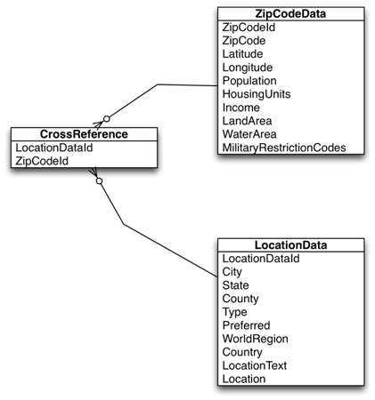

# Assignment 3: Data and SQL
This assignment, the third in the series, will familiarize the student with storing large amounts of data locally in the app and using the embedded SQL engine.   

## Table of Contents

<!-- START doctoc generated TOC please keep comment here to allow auto update -->
<!-- DON'T EDIT THIS SECTION, INSTEAD RE-RUN doctoc TO UPDATE -->

- [Overview](#overview)
- [Learning Objectives](#learning-objectives)
- [Prerequisites](#prerequisites)
- [Grading Criteria](#grading-criteria)
- [Helpful Resources](#helpful-resources)
- [Submission Instructions](#submission-instructions)
  - [Git Workflow](#git-workflow)
- [Help and Discussion](#help-and-discussion)

<!-- END doctoc generated TOC please keep comment here to allow auto update -->

## Overview
In this tech challenge, the student will be building an app that parses a converts a CSV file into a SQLite database. The app then allows the user to search by zipcode or locality to display a scrolling list of results. When an item is selected, the app takes the user to a map view that is centered on the selected locality with a map pin. The user can select the pin and be take to a further details page that displays the full demographic information on the locality.

## Learning Objectives
When completed the student should have an understanding of the following concepts:

* Embedded SQL engine
* Content Providers
* Managing large amounts of data in a small amount of space
* Map Views
* String manipulation

## Prerequisites
Before starting this tech challenge, a student should be familiar with the follow concepts and have the following environment

* All prior Android Assignments are completed
* The Android SDK installed on the development device
* Android Studio (the latest stable release) installed on the development device

## Grading Criteria
Here are some specific requirements the graders will be looking for in your submission in order for your submission to be accepted:

The application must do the following:

* Store a database of all of the zip codes in the United States along with geographic and demographic information.  See the Recommended Approach section for the raw data file.
* The zip code data has a many-to-many relationship between zip code and locality name.  One locality may have multiple zip codes and one zip code may have multiple localities.
* The zip code data originates in a CSV file.  The application should read and convert this CSV file into a local database only on the first run of the application on the phone.  Subsequent runs must use the local database created in the first run.  You may pre-convert the data into the appropriate SQL database prior to deployment.
* The user must be able to search by zip code or locality name to find all localities that match.
* Free text queries are not required.
* Users must be able to search by partial zip code or partial locality. Localities are just the city name.  For example, if a user searches for Richmond they should find both Richmond, VA and Richmond, IN.
* The search results must be displayed in a view that displays all of the results without requiring user driven pagination (i.e. infinite tables).
* The view for each entry must display the zip code, city, state, zip
* If the user selects an entry the app must open a new view with a map centered on the locality.  
* The map must display a pin centered on the lat/lng of the location.
* If the user taps the map pin the app should transition to a new page that displays the full demographic data for the locality.
* The application must use the embedded SQL engine provided by the platform (SQLite).
* The application must conform to best practice Material Design guidelines.

## Helpful Resources
These are some helpful documentation links and resources to help you be successful in completing this tech challenge:

* For the needed data file, see: "./supporting-resources/free-zipcode-database.csv"
* Suggested ERD (Entity Relationship Diagram):

* Web resources
    * SQLite: [http://goo.gl/wSV33](http://goo.gl/wSV33)
    * Loaders: [http://goo.gl/QsFb1](http://goo.gl/QsFb1)
    * Content Provider: [http://goo.gl/MGMf7](http://goo.gl/MGMf7)
    * Maps Start Guide: [https://goo.gl/fgdUM](https://goo.gl/fgdUM)
* Suggested APIs
    * ListView or TableLayout or RecyclerView
    * MapFragment - Maps API v2 must be used

## Submission Instructions
Please provide these specific items when submitting your tech challenge, placing them inside of your repository where your grader can easily find them:

* An application that meets the above requirements running on the target mobile device is required for completion of this assignment. Please place the `.apk` file of the completed app in the base directory of your repository.
* The code for your submission should be at the base directory of the repo, or within a specified child directory.

### Git Workflow
* When you start a tech challenge, the tech challenge admin will create a private repository for you.
* There will be two branches in the repo, `master` and `develop`.
* Do all your work in the `develop` branch.
* As you work, push your changes up to your GitLab repo.
* When you are finished, make a merge request to the `master` version of your private repo.
* At this point, the graders will review your merge request and offer comments where needed.
* You may be asked to push updates, corrections to your develop branch in response to the coments by graders. You `don't` need to create another merge request.
* When the grader is satisfied, he will merge your code into the master branch of your private repo.
* Now celebrate, the Tech Challenge is completed!

## Help and Discussion

If you need help on this Tech Challenge or would like to discuss it / leave feedback, please check out the [Mobile Tech Challenges team](https://teams.microsoft.com/l/team/19:3c6cb4196d9d47b9ad2510126e14ad44@thread.skype/) in Microsoft Teams, especially the [Help and Discussion channel](https://teams.microsoft.com/l/channel/19:bb28957ec53d452787c8c3aeae850127@thread.skype/Mobile%20-%20Android%20-%20Help%20and%20Discussion).

